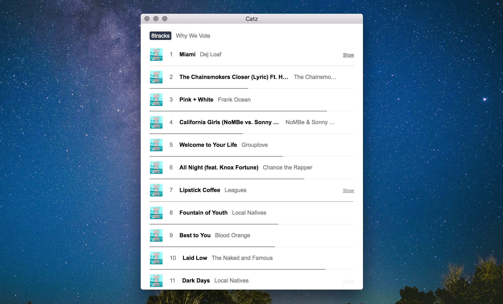

# Catz

[](https://catz.io)
[](https://github.com/cadejscroggins/catz/releases)
[](https://gitter.im/cadejscroggins/omgcatz)

Download music from various websites. [8tracks](https://8tracks.com) and [SoundCloud](https://soundcloud.com) are currently supported.



## Development Setup

Before you do anything, you&rsquo;ll need to have [Git](https://git-scm.com/) and [Node](https://nodejs.org/en/) installed.

```shell
# clone
git clone https://github.com/cadejscroggins/catz
cd catz

# install
npm i -g yarn && yarn

# serve
yarn start
```

## Contributing

Before spending lots of time on something, ask for feedback in [the chat](https://gitter.im/cadejscroggins/omgcatz).

## License

This project is licensed under the MIT License&mdash;see the [LICENSE.txt](LICENSE.txt) file for details.
